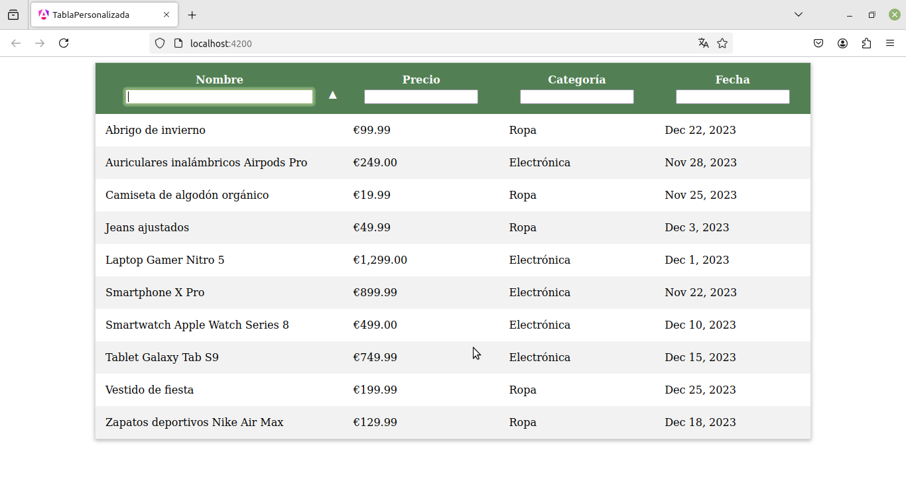

# Tabla Personalizada

Este proyecto es una tabla personalizada desarrollada con Angular que permite ordenar y filtrar datos de manera interactiva. Utiliza una directiva para gestionar la lógica de ordenación y filtrado.

## Características

- Ordenación de columnas al hacer clic en los encabezados.
- Filtrado de datos en tiempo real.
- Emisión de eventos para actualizar la lista de datos filtrados y ordenados.

## Estructura del Proyecto

- **Directivas**: Contiene la directiva `SortFilterDirective` que maneja la lógica de ordenación y filtrado.
- **Componentes**: Contiene el componente `TablaComponent` que muestra la tabla de productos.

## Instalación

1. Clona el repositorio:
   ```bash
   git clone https://github.com/lytsistemas/tabla-personalizada-ejemplo.git
   ```
2. Navega al directorio del proyecto:
   ```bash
   cd tabla-personalizada
   ```
3. Instala las dependencias:
   ```bash
   npm install
   ```

## Uso

1. Inicia la aplicación:
   ```bash
   ng serve
   ```
2. Abre tu navegador y navega a `http://localhost:4200`.

## Ejemplo de Uso

```typescript
// Ejemplo de cómo usar la directiva en un componente
@Component({
  selector: 'app-tabla',
  templateUrl: './tabla.component.html',
  styleUrls: ['./tabla.component.css'],
  standalone: true,
})
export class TablaComponent {
  productos: Producto[] = [
    // ...lista de productos...
  ];

  filteredProductos: Producto[] = [...this.productos];

  onDataChanged(filteredData: Producto[]) {
    this.filteredProductos = filteredData;
  }
}
```

## Captura de pantalla



## Licencia

Este proyecto está licenciado bajo la Licencia MIT. Consulta el archivo [LICENSE](LICENSE) para más detalles.
